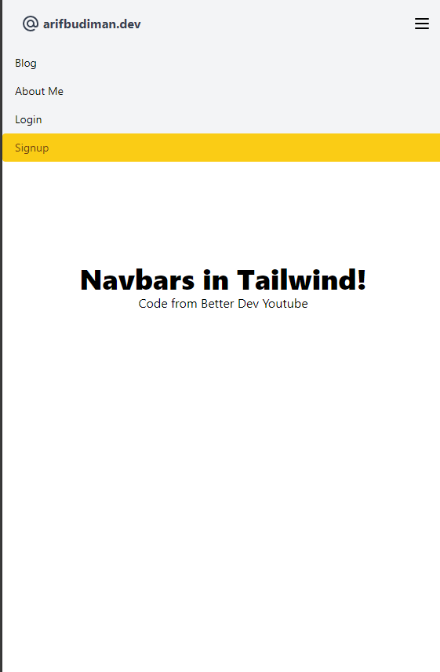
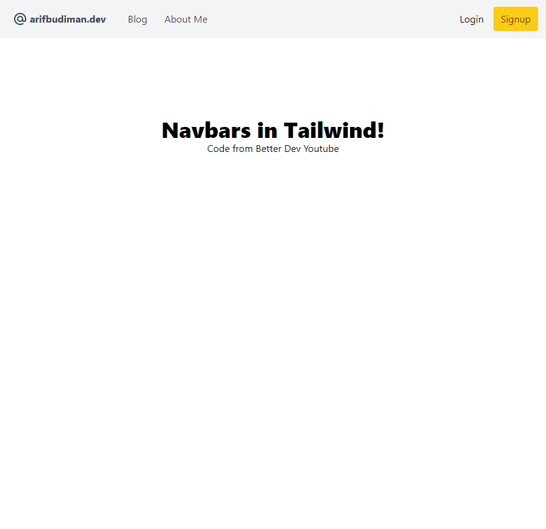

# Tailwind Navbar

[Tutorial from Better Dev](https://www.youtube.com/watch?v=puaX_nhTMRU)

Install the required dependencies with `npm`:

```sh
npm install
```

Then start the dev server:

```sh
npx tailwindcss -i ./src/input.css -o ./dist/output.css --watch
```


